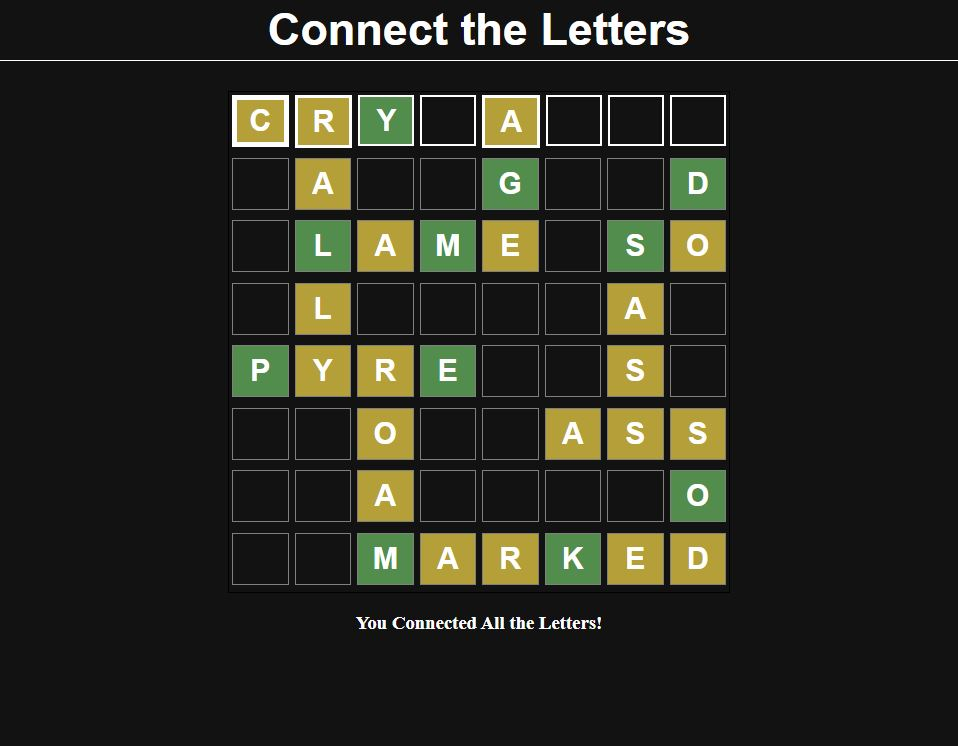

# connect-the-letters

Mayari Cameron Flores
Digital Media Project

Connect the Letters

Instructions:

* Connect the green letters using words! (Make sure you can reach each green letter from every other green letter like so!)

* Valid words will be colored yellow
* To switch from typing horizontal to vertical double-click a square
* Refresh to start a new game

Todo:

* Make it so that every randomly generated board is possible (generate a crossword and randomly select letters so that we know there's a least one solution)
* Fix valid words highlight to show up as soon as word is created
* Fix half valid letters (words that are valid horizontally but not vertically, and vice versa, should be colored differently)